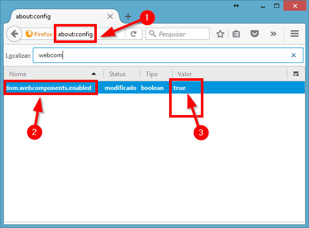

Shadow DOM
==========

Este é um exemplo de uso para Shadow DOM.

## Suporte em navegadores:
* `IE:` Como sempre, não suporta
* `Edge:` Herdou o padrão do `IE`
* `Firefox:` 47 `[requer habilitar]`
* `Chrome:` 49 
* `Safari:` 10
* `Opera:` 39

### Habilitando o suporte no **Firefox**:

